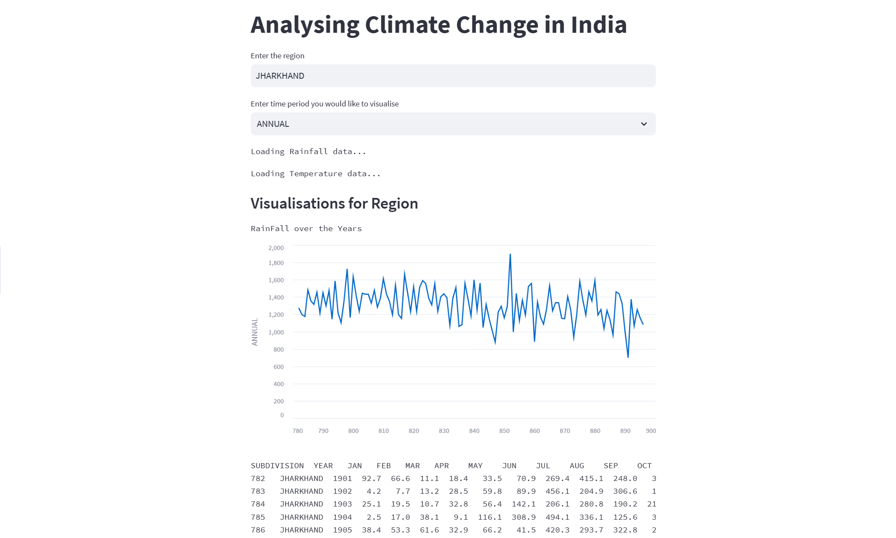
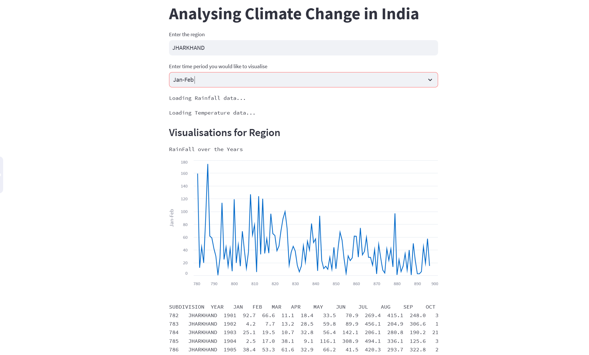

# Biome-Body
A simple data visualization web interface made using Streamlit

## Installation and Setup
- main.py: A requirements.txt contains all the libraries used. Can be installed using a virtual environment. 
- Notebook: Jupyter Notebook Source File, can be uploaded on Google Colab or Anaconda

## Description
The streamlit web interface helps users select a region and time period in which they wish to analyze the rainfall over the last 100 years. Moreover, the notebook contains code to implement an RNN model to predict the mean rainfall. 

